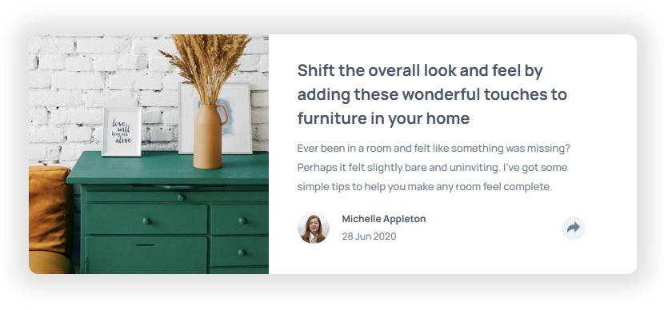
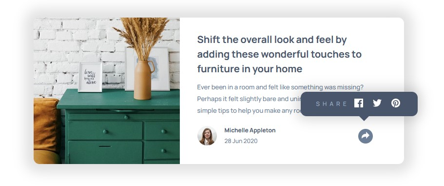
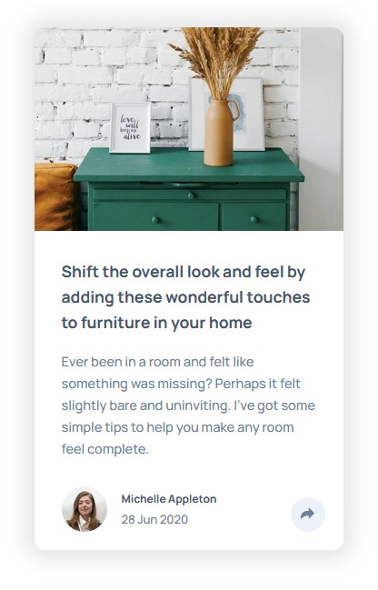
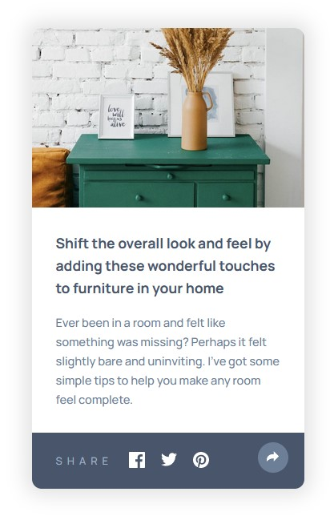

# Frontend Mentor - Article preview component solution

This is a solution to the [Article preview component challenge on Frontend Mentor](https://www.frontendmentor.io/challenges/article-preview-component-dYBN_pYFT). Frontend Mentor challenges help you improve your coding skills by building realistic projects. 

## Table of contents

- [Overview](#overview)
  - [The challenge](#the-challenge)
  - [Screenshot](#screenshot)
  - [Links](#links)
- [My process](#my-process)
  - [Built with](#built-with)
  - [What I learned](#what-i-learned)
  - [Continued development](#continued-development)
  - [Useful resources](#useful-resources)
- [Author](#author)
- [Acknowledgments](#acknowledgments)

## Overview

### The challenge

Users should be able to:

- View the optimal layout for the component depending on their device's screen size
- See the social media share links when they click the share icon

### Screenshot






### Links

- Solution URL: [Add solution URL here](https://your-solution-url.com)
- Live Site URL: [Add live site URL here](https://your-live-site-url.com)

## My process

### Built with

- Semantic HTML5 markup
- CSS custom properties
- Flexbox
- Mobile-first workflow
- [React](https://reactjs.org/) - JS library

### What I learned

- Better understanding and use of CSS position and its absolute property
```css
.card-socials-container {
    position: absolute;
    left: 212px;
    bottom: 40px;
} 
```
- Using CSS border property to create a triangle
```css
.card-socials-container-triangle {
    width: 0px;
    height: 0px;
    border-left: 10px solid transparent;
    border-right: 10px solid transparent;
    border-top: 10px solid var(--very-dark-grayish-blue);
    position: absolute;
    bottom: -10px;
    left:120px;
}
```
- Using CSS overflow property to hide a section of an image
```css
.card-img-container {
    height: 224px;
    overflow: hidden;
}
```

## Author

- Website - [Portfolio](https://www.adriansalinas.tech)
